# Accessibility Testing Agent - Architecture Flow Chart

```mermaid
graph TB
    %% Entry Point
    CLI[Command Line Interface<br/>main_parallel.py] --> INIT[Initialize Components]
    
    %% Configuration Loading
    INIT --> CONFIG_LOAD{Load Configuration}
    CONFIG_LOAD --> CONFIG_FILE[config.json<br/>• Device profiles<br/>• Axe rules<br/>• Browser settings]
    CONFIG_LOAD --> CSV_FILE[urls_to_test.csv<br/>• Pre-defined URLs]
    CONFIG_LOAD --> CLI_ARGS[CLI Arguments<br/>• URL override<br/>• Device selection<br/>• Max pages]
    
    %% Component Initialization
    CONFIG_FILE --> AGENT_INIT[Agent Initialization]
    CSV_FILE --> AGENT_INIT
    CLI_ARGS --> AGENT_INIT
    
    AGENT_INIT --> CRAWLER_INIT[Crawler Component<br/>crawler.py]
    AGENT_INIT --> ANALYZER_INIT[LocalAnalyzer Component<br/>local_analyzer.py]
    AGENT_INIT --> REPORTER_INIT[ReportGenerator Component<br/>reporter.py]
    
    %% Main Execution Flow
    CRAWLER_INIT --> PLAYWRIGHT_START[Launch Playwright Instance]
    ANALYZER_INIT --> PLAYWRIGHT_START
    REPORTER_INIT --> PLAYWRIGHT_START
    
    PLAYWRIGHT_START --> URL_SOURCE{URL Source Decision}
    
    %% URL Discovery
    URL_SOURCE -->|No CSV provided| CRAWL_PHASE[Web Crawling Phase]
    URL_SOURCE -->|CSV provided| PREDEFINED_URLS[Use Predefined URLs]
    
    CRAWL_PHASE --> CRAWL_BROWSER[Launch Chromium Browser<br/>for Crawling]
    CRAWL_BROWSER --> CRAWL_PROCESS[Crawl Process:<br/>• Start from base URL<br/>• Follow same-domain links<br/>• Respect max_pages limit<br/>• Build URL list]
    CRAWL_PROCESS --> URL_LIST[Discovered URLs List]
    
    PREDEFINED_URLS --> URL_LIST
    
    %% Device Testing Loop
    URL_LIST --> DEVICE_LOOP[For Each Device Type:<br/>desktop, mobile-ios,<br/>mobile-android, tablet-ios,<br/>tablet-android]
    
    DEVICE_LOOP --> DEVICE_CONFIG[Load Device Profiles:<br/>• Viewport dimensions<br/>• User agents<br/>• Touch capabilities<br/>• Screen scaling]
    
    DEVICE_CONFIG --> BROWSER_LAUNCH[Launch Multiple Browser Instances<br/>for Parallel Processing]
    
    %% Parallel Processing
    BROWSER_LAUNCH --> WORKER_POOL[Worker Pool Creation]
    WORKER_POOL --> WORKER1[Worker 1<br/>Chromium + Device Config]
    WORKER_POOL --> WORKER2[Worker 2<br/>Chromium + Device Config]
    WORKER_POOL --> WORKER3[Worker 3<br/>Chromium + Device Config]
    WORKER_POOL --> WORKERN[Worker N<br/>Chromium + Device Config]
    
    %% URL Queue Processing
    URL_LIST --> URL_QUEUE[URL Queue<br/>Async Processing]
    
    WORKER1 --> URL_QUEUE
    WORKER2 --> URL_QUEUE
    WORKER3 --> URL_QUEUE
    WORKERN --> URL_QUEUE
    
    %% Page Analysis Process
    URL_QUEUE --> PAGE_LOAD[Load Page with Device Emulation:<br/>• Set viewport<br/>• Set user agent<br/>• Configure touch<br/>• Wait for DOM content]
    
    PAGE_LOAD --> AXE_ANALYSIS[Axe-Core Analysis:<br/>• Inject axe-core library<br/>• Run WCAG 2.1 AA tests<br/>• Run best practice tests<br/>• Collect violations]
    
    AXE_ANALYSIS --> SCREENSHOT[Screenshot Capture:<br/>• Capture failing elements<br/>• Organize by device type<br/>• Generate unique filenames]
    
    SCREENSHOT --> VIOLATION_DATA[Violation Data Collection:<br/>• Rule violations<br/>• Impact severity<br/>• Element selectors<br/>• Screenshot paths]
    
    %% Results Aggregation
    VIOLATION_DATA --> RESULTS_STORE[Results Storage<br/>by Device Type]
    RESULTS_STORE --> DEVICE_COMPLETE{All URLs<br/>Processed?}
    
    DEVICE_COMPLETE -->|No| URL_QUEUE
    DEVICE_COMPLETE -->|Yes| NEXT_DEVICE{More Device<br/>Types?}
    
    NEXT_DEVICE -->|Yes| DEVICE_LOOP
    NEXT_DEVICE -->|No| REPORT_GENERATION
    
    %% Report Generation
    REPORT_GENERATION --> CONSOLIDATE[Consolidate All Results<br/>Across Device Types]
    
    CONSOLIDATE --> REPORT_FORMAT{Report Format<br/>Selection}
    
    REPORT_FORMAT --> MD_REPORT[Markdown Report<br/>• Hierarchical structure<br/>• Device-specific sections<br/>• Violation summaries]
    REPORT_FORMAT --> JSON_REPORT[JSON Report<br/>• Structured data<br/>• API-friendly format<br/>• Machine readable]
    REPORT_FORMAT --> HTML_REPORT[HTML Report<br/>• Visual presentation<br/>• Interactive elements<br/>• Screenshot embedding]
    
    %% Output Generation
    MD_REPORT --> FILE_OUTPUT[File Output:<br/>results/accessibility_report.*<br/>Device-specific folders<br/>Screenshot directories]
    JSON_REPORT --> FILE_OUTPUT
    HTML_REPORT --> FILE_OUTPUT
    
    FILE_OUTPUT --> CLEANUP[Browser Cleanup<br/>Close All Instances]
    CLEANUP --> COMPLETE[Testing Complete<br/>Reports Generated]
    
    %% Progress Tracking
    VIOLATION_DATA --> PROGRESS[Progress Bar Updates<br/>tqdm Integration]
    PROGRESS --> CONSOLE[Console Output<br/>Real-time Status]
    
    %% Error Handling
    PAGE_LOAD -.->|Timeout/Error| ERROR_HANDLE[Error Handling:<br/>• Log failures<br/>• Continue processing<br/>• Mark as skipped]
    ERROR_HANDLE -.-> URL_QUEUE
    
    %% Configuration Details
    CONFIG_FILE -.-> DEVICE_DETAIL[Device Profile Details:<br/>• iPhone 15 Pro: 393x852<br/>• Galaxy S24: 384x854<br/>• iPad Pro: 1024x1366<br/>• Desktop: 1920x1080<br/>• Custom viewports]
    
    %% Styling
    classDef entryPoint fill:#e1f5fe,stroke:#0277bd,stroke-width:2px
    classDef component fill:#f3e5f5,stroke:#7b1fa2,stroke-width:2px
    classDef process fill:#e8f5e8,stroke:#388e3c,stroke-width:2px
    classDef decision fill:#fff3e0,stroke:#f57c00,stroke-width:2px
    classDef output fill:#ffebee,stroke:#d32f2f,stroke-width:2px
    classDef worker fill:#f1f8e9,stroke:#689f38,stroke-width:2px
    
    class CLI,INIT entryPoint
    class CRAWLER_INIT,ANALYZER_INIT,REPORTER_INIT,AGENT_INIT component
    class PAGE_LOAD,AXE_ANALYSIS,SCREENSHOT,CRAWL_PROCESS process
    class URL_SOURCE,DEVICE_COMPLETE,NEXT_DEVICE,REPORT_FORMAT decision
    class FILE_OUTPUT,COMPLETE,MD_REPORT,JSON_REPORT,HTML_REPORT output
    class WORKER1,WORKER2,WORKER3,WORKERN worker
```

## Architecture Overview

### Core Components

1. **Main Entry Point** (`main_parallel.py`)
   - Command-line interface with argument parsing
   - Configuration loading and validation
   - Component initialization and orchestration

2. **Agent** (`agent/agent.py`)
   - Central coordinator for the testing process
   - Manages parallel browser instances
   - Orchestrates device-specific testing workflows
   - Handles results aggregation

3. **Crawler** (`agent/crawler.py`)
   - Web crawling for URL discovery
   - Same-domain link following
   - Respects crawling limits (max_pages)
   - Builds comprehensive URL lists

4. **LocalAnalyzer** (`agent/local_analyzer.py`)
   - Axe-core integration for accessibility testing
   - WCAG 2.1 AA compliance checking
   - Screenshot capture for violations
   - Device-aware analysis with emulation

5. **ReportGenerator** (`agent/reporter.py`)
   - Multi-format report generation (MD, JSON, HTML)
   - Device-specific result organization
   - Violation severity and impact analysis
   - Screenshot integration in reports

### Key Features

#### Parallel Processing Architecture
- **Multi-Device Testing**: Simultaneous testing across desktop, mobile, and tablet devices
- **Worker Pool Pattern**: Multiple browser instances process URLs concurrently
- **Async Queue Processing**: Efficient URL distribution across workers
- **Progress Tracking**: Real-time progress bars with tqdm integration

#### Device Emulation System
- **Comprehensive Device Profiles**: iPhone, Samsung Galaxy, iPad, desktop configurations
- **Accurate Emulation**: Viewport, user agent, touch capabilities, scaling factors
- **Platform-Specific Testing**: iOS, Android, desktop browser variations
- **Responsive Design Validation**: Multiple screen sizes and orientations

#### Accessibility Testing Engine
- **Axe-Core Integration**: Industry-standard accessibility rule engine
- **WCAG Compliance**: 2.1 AA standards with best practice rules
- **Visual Evidence**: Automatic screenshot capture of failing elements
- **Detailed Reporting**: Element selectors, impact levels, remediation guidance

#### Flexible Configuration
- **JSON Configuration**: Device profiles, testing rules, output settings
- **CSV URL Input**: Pre-defined URL lists for targeted testing
- **CLI Overrides**: Runtime configuration adjustments
- **Multi-Format Output**: Markdown, JSON, HTML report generation

### Data Flow

1. **Initialization**: Load configuration, parse arguments, initialize components
2. **URL Discovery**: Either crawl website or use predefined URL list
3. **Device Testing Loop**: For each device type, launch parallel browser workers
4. **Page Analysis**: Load pages with device emulation, run axe-core tests
5. **Results Collection**: Aggregate violations, capture screenshots, track progress
6. **Report Generation**: Consolidate results, generate multi-format reports
7. **Cleanup**: Close browsers, save files, display completion status

### Performance Optimizations

- **Browser Reuse**: Single Chromium engine for consistency and efficiency
- **Parallel Workers**: Multiple browser instances for concurrent URL processing
- **Async Processing**: Non-blocking I/O operations throughout the pipeline
- **Queue Management**: Efficient URL distribution with asyncio.Queue
- **Progress Monitoring**: Real-time feedback without blocking execution

This architecture enables comprehensive accessibility testing across multiple device types while maintaining high performance through parallel processing and efficient resource management.
