# Accessibility Testing Agent - Enhanced Architecture Flow Chart

```mermaid
flowchart TD
    %% System Entry and Bootstrap
    START([System Startup]) --> CLI_PARSE[CLI Argument Parser<br/>📋 URL, device, pages, config]
    CLI_PARSE --> BOOTSTRAP{Bootstrap Phase}
    
    %% Configuration Management
    BOOTSTRAP --> LOAD_CONFIG[🔧 Load Configuration]
    LOAD_CONFIG --> CONFIG_JSON[(config.json<br/>📱 Device Profiles<br/>🔍 Axe Rules<br/>🌐 Browser Settings)]
    LOAD_CONFIG --> CSV_INPUT[(urls_to_test.csv<br/>📄 Target URLs)]
    LOAD_CONFIG --> ENV_VARS[Environment Variables<br/>🔑 Runtime Settings]
    
    %% Component Assembly
    CONFIG_JSON --> ASSEMBLE[🏗️ Component Assembly]
    CSV_INPUT --> ASSEMBLE
    ENV_VARS --> ASSEMBLE
    
    ASSEMBLE --> AGENT_CORE[🤖 Agent Core<br/>Orchestration Engine]
    ASSEMBLE --> WEB_CRAWLER[🕷️ Web Crawler<br/>Discovery Module]
    ASSEMBLE --> AXE_ANALYZER[⚡ Axe Analyzer<br/>Testing Engine]
    ASSEMBLE --> REPORT_ENGINE[📊 Report Engine<br/>Output Generator]
    
    %% Playwright Initialization
    AGENT_CORE --> PW_INIT[🎭 Playwright Initialization]
    WEB_CRAWLER --> PW_INIT
    AXE_ANALYZER --> PW_INIT
    REPORT_ENGINE --> PW_INIT
    
    %% URL Strategy Decision
    PW_INIT --> URL_STRATEGY{🎯 URL Strategy}
    URL_STRATEGY -->|Discovery Mode| AUTO_CRAWL[🔍 Automated Crawling]
    URL_STRATEGY -->|Targeted Mode| PRESET_URLS[📋 Predefined URLs]
    
    %% Crawling Pipeline
    AUTO_CRAWL --> CRAWLER_BROWSER[🌐 Crawler Browser Instance]
    CRAWLER_BROWSER --> CRAWL_ENGINE[🕸️ Crawling Engine<br/>• Domain restriction<br/>• Depth limiting<br/>• Link extraction<br/>• URL validation]
    CRAWL_ENGINE --> URL_COLLECTION[📝 URL Collection]
    
    PRESET_URLS --> URL_COLLECTION
    
    %% Device Testing Matrix
    URL_COLLECTION --> DEVICE_MATRIX[📱 Device Testing Matrix]
    DEVICE_MATRIX --> DESKTOP_TRACK[💻 Desktop Track<br/>Chrome • Safari • Edge<br/>1920x1080 • 2560x1440]
    DEVICE_MATRIX --> MOBILE_IOS_TRACK[📱 Mobile iOS Track<br/>iPhone 15 Pro • iPhone 14<br/>393x852 • 390x844]
    DEVICE_MATRIX --> MOBILE_AND_TRACK[🤖 Mobile Android Track<br/>Galaxy S24 • Pixel 8<br/>384x854 • 412x915]
    DEVICE_MATRIX --> TABLET_IOS_TRACK[📋 Tablet iOS Track<br/>iPad Pro • iPad Air<br/>1024x1366 • 820x1180]
    DEVICE_MATRIX --> TABLET_AND_TRACK[📱 Tablet Android Track<br/>Galaxy Tab S9 • Surface Pro<br/>1024x600 • 1368x912]
    
    %% Parallel Worker Architecture
    DESKTOP_TRACK --> WORKER_FACTORY[⚙️ Worker Factory]
    MOBILE_IOS_TRACK --> WORKER_FACTORY
    MOBILE_AND_TRACK --> WORKER_FACTORY
    TABLET_IOS_TRACK --> WORKER_FACTORY
    TABLET_AND_TRACK --> WORKER_FACTORY
    
    WORKER_FACTORY --> WORKER_A[🔧 Worker Alpha<br/>Browser Instance A]
    WORKER_FACTORY --> WORKER_B[🔧 Worker Beta<br/>Browser Instance B]
    WORKER_FACTORY --> WORKER_C[🔧 Worker Gamma<br/>Browser Instance C]
    WORKER_FACTORY --> WORKER_D[🔧 Worker Delta<br/>Browser Instance D]
    
    %% Task Distribution
    URL_COLLECTION --> TASK_QUEUE[📋 Task Queue<br/>Async Distribution]
    
    WORKER_A -.-> TASK_QUEUE
    WORKER_B -.-> TASK_QUEUE
    WORKER_C -.-> TASK_QUEUE
    WORKER_D -.-> TASK_QUEUE
    
    %% Page Processing Pipeline
    TASK_QUEUE --> PAGE_SETUP[🎭 Page Setup<br/>• Device emulation<br/>• Viewport config<br/>• User agent setup<br/>• Touch simulation]
    
    PAGE_SETUP --> PAGE_LOAD[🔄 Page Loading<br/>• Navigation<br/>• DOM ready wait<br/>• Resource loading<br/>• Error handling]
    
    PAGE_LOAD --> AXE_INJECT[💉 Axe Injection<br/>• Library insertion<br/>• Rule configuration<br/>• Context setup]
    
    AXE_INJECT --> SCAN_EXECUTE[🔍 Accessibility Scan<br/>• WCAG 2.1 AA<br/>• Best practices<br/>• Color contrast<br/>• Keyboard navigation]
    
    SCAN_EXECUTE --> EVIDENCE_CAPTURE[📸 Evidence Capture<br/>• Element screenshots<br/>• Violation mapping<br/>• Context preservation]
    
    EVIDENCE_CAPTURE --> DATA_AGGREGATE[📊 Data Aggregation<br/>• Violation cataloging<br/>• Severity classification<br/>• Remediation linking]
    
    %% Results Processing
    DATA_AGGREGATE --> RESULTS_DB[(📚 Results Database<br/>Device-specific storage)]
    RESULTS_DB --> PROGRESS_TRACKER[📈 Progress Tracking<br/>Real-time updates]
    
    PROGRESS_TRACKER --> COMPLETION_CHECK{✅ Completion Check}
    COMPLETION_CHECK -->|More URLs| TASK_QUEUE
    COMPLETION_CHECK -->|Device Complete| NEXT_DEVICE_CHECK{🔄 Next Device?}
    
    NEXT_DEVICE_CHECK -->|Yes| DEVICE_MATRIX
    NEXT_DEVICE_CHECK -->|No| REPORT_PHASE[📋 Report Generation Phase]
    
    %% Report Generation Pipeline
    REPORT_PHASE --> CONSOLIDATION[🔄 Data Consolidation<br/>Cross-device aggregation]
    
    CONSOLIDATION --> FORMAT_SELECTION{📄 Format Selection}
    
    FORMAT_SELECTION --> MD_GENERATOR[📝 Markdown Generator<br/>• Hierarchical structure<br/>• Code snippets<br/>• Violation summaries]
    
    FORMAT_SELECTION --> JSON_GENERATOR[🔗 JSON Generator<br/>• Structured data<br/>• API compatibility<br/>• Machine parsing]
    
    FORMAT_SELECTION --> HTML_GENERATOR[🌐 HTML Generator<br/>• Interactive UI<br/>• Visual elements<br/>• Screenshot gallery]
    
    %% Output Management
    MD_GENERATOR --> FILE_SYSTEM[💾 File System Output]
    JSON_GENERATOR --> FILE_SYSTEM
    HTML_GENERATOR --> FILE_SYSTEM
    
    FILE_SYSTEM --> DIRECTORY_STRUCTURE[📁 Directory Structure<br/>results/<br/>├── desktop/<br/>├── mobile/ios/<br/>├── mobile/android/<br/>├── tablet/ios/<br/>└── tablet/android/]
    
    DIRECTORY_STRUCTURE --> CLEANUP_PHASE[🧹 Cleanup Phase<br/>Browser termination]
    CLEANUP_PHASE --> COMPLETION([✨ Testing Complete])
    
    %% Real-time Monitoring
    PROGRESS_TRACKER --> CONSOLE_OUTPUT[🖥️ Console Output<br/>Status indicators]
    SCAN_EXECUTE --> MONITOR[📊 Performance Monitor<br/>Memory • CPU • Time]
    
    %% Error Recovery
    PAGE_LOAD -.->|Timeout| ERROR_RECOVERY[⚠️ Error Recovery<br/>• Retry logic<br/>• Skip mechanisms<br/>• Failure logging]
    ERROR_RECOVERY -.-> TASK_QUEUE
    
    %% Device Configuration Details
    CONFIG_JSON -.-> DEVICE_SPECS[📱 Device Specifications<br/>• Viewport dimensions<br/>• Pixel ratios<br/>• Touch capabilities<br/>• Platform identifiers]
    
    %% Styling Definitions
    classDef startEnd fill:#e8f5e8,stroke:#2e7d32,stroke-width:3px
    classDef process fill:#e3f2fd,stroke:#1976d2,stroke-width:2px
    classDef decision fill:#fff3e0,stroke:#f57c00,stroke-width:2px
    classDef storage fill:#f3e5f5,stroke:#7b1fa2,stroke-width:2px
    classDef worker fill:#e8f5e8,stroke:#388e3c,stroke-width:2px
    classDef output fill:#ffebee,stroke:#d32f2f,stroke-width:2px
    classDef monitor fill:#f1f8e9,stroke:#689f38,stroke-width:2px
    
    class START,COMPLETION startEnd
    class CLI_PARSE,LOAD_CONFIG,ASSEMBLE,PW_INIT,AUTO_CRAWL,CRAWL_ENGINE,PAGE_SETUP,PAGE_LOAD,AXE_INJECT,SCAN_EXECUTE,EVIDENCE_CAPTURE process
    class BOOTSTRAP,URL_STRATEGY,COMPLETION_CHECK,NEXT_DEVICE_CHECK,FORMAT_SELECTION decision
    class CONFIG_JSON,CSV_INPUT,URL_COLLECTION,RESULTS_DB,TASK_QUEUE storage
    class WORKER_A,WORKER_B,WORKER_C,WORKER_D worker
    class MD_GENERATOR,JSON_GENERATOR,HTML_GENERATOR,FILE_SYSTEM,DIRECTORY_STRUCTURE output
    class PROGRESS_TRACKER,CONSOLE_OUTPUT,MONITOR monitor
```

## System Architecture Deep Dive

### 🎯 **Core Execution Flow**

#### Phase 1: System Bootstrap
- **CLI Interface**: Command-line argument parsing with validation
- **Configuration Loading**: Multi-source configuration management
- **Component Assembly**: Dependency injection and initialization
- **Playwright Setup**: Browser automation framework initialization

#### Phase 2: URL Discovery & Strategy
- **Automated Crawling**: Intelligent web crawling with domain restrictions
- **Targeted Testing**: Pre-defined URL list processing
- **URL Validation**: Link verification and filtering
- **Collection Management**: Efficient URL storage and retrieval

#### Phase 3: Multi-Device Testing Matrix
- **Desktop Testing**: Multiple browser engines and resolutions
- **Mobile iOS**: iPhone device emulation with accurate configurations
- **Mobile Android**: Android device simulation with platform-specific settings
- **Tablet Testing**: Large-screen device testing for both platforms
- **Cross-Platform Validation**: Comprehensive device coverage

#### Phase 4: Parallel Processing Engine
- **Worker Factory**: Dynamic worker creation based on system resources
- **Task Distribution**: Intelligent load balancing across workers
- **Async Queue Management**: Non-blocking URL processing
- **Resource Optimization**: Memory and CPU-efficient execution

#### Phase 5: Accessibility Analysis Pipeline
- **Page Setup**: Device-specific emulation configuration
- **Content Loading**: Robust page loading with error handling
- **Axe Integration**: Industry-standard accessibility rule engine
- **Violation Detection**: WCAG 2.1 AA compliance checking
- **Evidence Collection**: Automated screenshot capture for violations

#### Phase 6: Results & Reporting
- **Data Aggregation**: Cross-device result consolidation
- **Format Generation**: Multi-format report creation
- **File Management**: Organized output structure
- **Performance Metrics**: Execution statistics and insights

### 🚀 **Performance Features**

#### Concurrency Architecture
- **Parallel Workers**: Multiple browser instances for concurrent processing
- **Async Operations**: Non-blocking I/O throughout the pipeline
- **Queue Management**: Efficient task distribution and completion tracking
- **Resource Pooling**: Optimized browser instance management

#### Scalability Design
- **Dynamic Worker Scaling**: Automatic worker adjustment based on workload
- **Memory Management**: Efficient resource allocation and cleanup
- **Error Resilience**: Robust error handling with automatic recovery
- **Progress Monitoring**: Real-time execution feedback

#### Optimization Strategies
- **Browser Reuse**: Single Chromium engine for consistency
- **Intelligent Caching**: Optimized resource loading
- **Batch Processing**: Efficient URL grouping and processing
- **Performance Profiling**: Built-in monitoring and metrics

### 📊 **Data Flow Architecture**

#### Input Sources
- **Configuration Files**: JSON-based settings and device profiles
- **CSV Data**: Structured URL input for targeted testing
- **CLI Parameters**: Runtime configuration overrides
- **Environment Variables**: System-level settings

#### Processing Layers
- **Discovery Layer**: Web crawling and URL collection
- **Emulation Layer**: Device-specific browser configuration
- **Analysis Layer**: Accessibility testing and violation detection
- **Aggregation Layer**: Result consolidation and organization

#### Output Formats
- **Markdown Reports**: Human-readable documentation
- **JSON Data**: Machine-readable structured output
- **HTML Dashboards**: Interactive visual reports
- **Screenshot Evidence**: Visual violation documentation

### 🔧 **Technical Implementation**

#### Browser Management
- **Playwright Integration**: Modern browser automation
- **Device Emulation**: Accurate mobile and tablet simulation
- **Network Conditions**: Realistic testing environments
- **Performance Monitoring**: Resource usage tracking

#### Accessibility Testing
- **Axe-Core Engine**: Industry-standard rule implementation
- **WCAG Compliance**: 2.1 AA standard adherence
- **Custom Rules**: Extensible rule configuration
- **Violation Mapping**: Detailed issue identification

#### Error Handling
- **Graceful Degradation**: Continued operation on failures
- **Retry Mechanisms**: Automatic failure recovery
- **Logging Systems**: Comprehensive error tracking
- **User Feedback**: Clear error reporting

This enhanced architecture provides a comprehensive, scalable, and efficient accessibility testing solution with advanced parallel processing capabilities and extensive device coverage.
